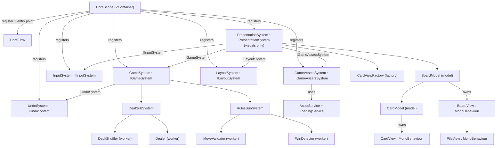
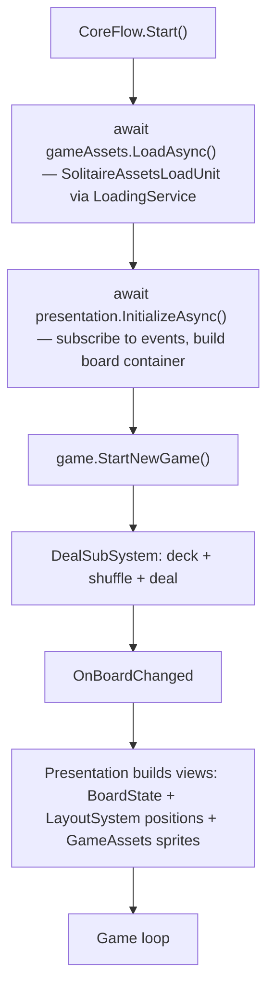
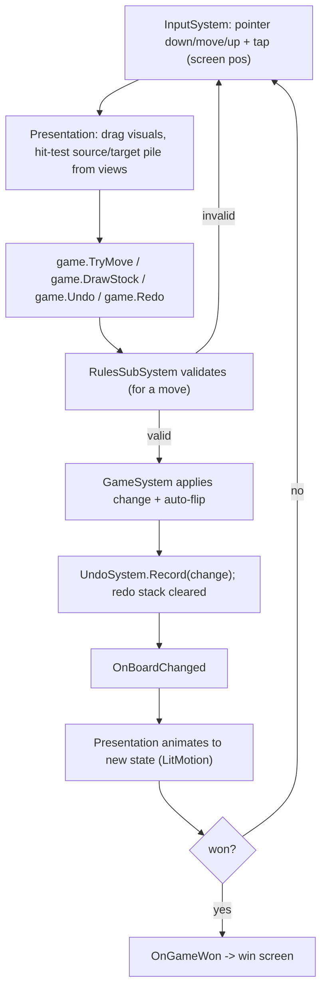

# Requirements Overview: Solitaire (Klondike, Draw-1)

> **Type:** Overview document (system & requirements registry)
> **References:** [architecture-rules.md](../Architecture/architecture-rules.md), [glossary.md](../Architecture/glossary.md), [unity-rules.md](../Architecture/unity-rules.md), [domain-responsibility.md](../Architecture/domain-responsibility.md), [constants.md](../Architecture/constants.md)

---

## 1. Purpose

This document set specifies the requirements for a **minimal, playable game of Klondike solitaire** (the **Draw-1** mode, with unlimited stock recycling) plus a single gameplay feature: **Undo/Redo**.

The goal is the simplest possible game loop: deal → moves (drag cards, draw from stock) → win check. No difficulty levels, no choice of solitaire variant, no meta-progression.

A key architectural principle of the project: the **presentation layer (`PresentationSystem`) is responsible for visuals only** (sprites, text, animation, moving cards nicely around the UI). Input, asset loading/unloading, layout math, and move history are extracted into **separate systems** and passed into presentation through interfaces (`I*System`).

These documents are the input for writing the C# / Unity code. Terminology follows [glossary.md](../Architecture/glossary.md) strictly; relationships follow [architecture-rules.md](../Architecture/architecture-rules.md) and [unity-rules.md](../Architecture/unity-rules.md).

---

## 2. System & domain map

A game is assembled in the `Core` scene (composition root — `CoreScope` / `CoreFlow`). Six top-level systems:

| System | Type | Domain | Unity? |
|---|---|---|---|
| `GameSystem` | System | Gameplay: board state, rules, deal, loop, Undo/Redo | No (pure logic) |
| `UndoSystem` | System | Move history: undo/redo stacks | No (pure logic) |
| `InputSystem` | System | Input: pointer/gestures, device abstraction | Yes |
| `GameAssetsSystem` | System | Loading/unloading of game assets (sprites, prefabs) | Yes |
| `LayoutSystem` | System | Computing pile positions and card fan offsets on screen | Yes |
| `PresentationSystem` | System | Visuals only: views, sprites, text, animation, UI movement | Yes |

Subsystems of `GameSystem`:

| Subsystem | Domain | Workers |
|---|---|---|
| `DealSubSystem` | Deck, shuffle, initial deal | `DeckShuffler`, `Dealer` |
| `RulesSubSystem` | Move validation, win detection | `MoveValidator`, `WinDetector` |

Existing infrastructure (used, not duplicated): `LoadingService`, `SceneManager`, `AssetService`, `Log`, VContainer `*Scope`/`*Flow` — see [domain-responsibility.md](../Architecture/domain-responsibility.md).

---

## 3. Decomposition & relationships

All cross-system links go **through interfaces** passed into constructors; the graph is assembled in `CoreScope`. The `DealSubSystem` and `RulesSubSystem` subsystems are invisible outside `GameSystem` and never call each other directly (rule 2 in [architecture-rules.md](../Architecture/architecture-rules.md)).

---

## 4. Initialization & loading

`CoreFlow` (the `Core` scene entry point) first loads assets asynchronously, then initializes presentation, then starts the game.

Complex initialization logic (preloading the set of sprites/prefabs) is placed in an `ILoadUnit` (by analogy with `FooLoadingUnit` / `BootstrapFlow`), not in constructors / `Awake` / `Start`.

---

## 5. Game loop (with Undo/Redo)

---

## 6. Document registry

| # | Document | Summary |
|---|---|---|
| 00 | `00-overview.md` | Overview, system map, registries, diagrams |
| 01 | `01-game-system.md` | `GameSystem`: domain model, board state, game loop, Draw-1, Undo/Redo, win |
| 02 | `02-deal-subsystem.md` | `DealSubSystem`: deck, shuffle, Klondike deal |
| 03 | `03-rules-subsystem.md` | `RulesSubSystem`: move rules, win condition |
| 04 | `04-undo-system.md` | `UndoSystem`: undo/redo stacks of `BoardChange` |
| 05 | `05-input-system.md` | `InputSystem`: pointer/gesture abstraction |
| 06 | `06-assets-system.md` | `GameAssetsSystem`: async asset load/unload |
| 07 | `07-layout-system.md` | `LayoutSystem`: UI position math |
| 08 | `08-presentation-system.md` | `PresentationSystem`: visuals only (models/views/animation) |

---

## 7. REQ-prefix registry

| Prefix | Document | System |
|---|---|---|
| `REQ-GAME-` | `01-game-system.md` | `GameSystem` |
| `REQ-DEAL-` | `02-deal-subsystem.md` | `DealSubSystem` |
| `REQ-RULE-` | `03-rules-subsystem.md` | `RulesSubSystem` |
| `REQ-UNDO-` | `04-undo-system.md` | `UndoSystem` |
| `REQ-INP-` | `05-input-system.md` | `InputSystem` |
| `REQ-AST-` | `06-assets-system.md` | `GameAssetsSystem` |
| `REQ-LAY-` | `07-layout-system.md` | `LayoutSystem` |
| `REQ-PRES-` | `08-presentation-system.md` | `PresentationSystem` |

---

## 8. Shared domain contracts & constants

To avoid circular dependencies (`GameSystem` ↔ `UndoSystem` ↔ `PresentationSystem`), passive domain types are extracted into **shared contracts**:

| Entity | Where it lives | Description |
|---|---|---|
| `Suit`, `Rank`, `CardColor`, `PileKind` | namespace level next to `RuntimeConstants` | Enums used by more than one system — per the rule in [constants.md](../Architecture/constants.md) |
| `Card`, `PileId`, `Pile`, `BoardState`, `BoardChange`, `Move` | shared namespace `Appodeal.Solitaire.Runtime.Domain` | Immutable data **with no behavior and no dependencies**; read by several systems |

These types are **not systems** (no API class, no business logic). Logic that operates on them lives only inside system API classes. The types are defined in detail in [01-game-system.md](01-game-system.md) §4.

Numeric/string constants live in `RuntimeConstants` ([constants.md](../Architecture/constants.md)); new blocks: `RuntimeConstants.Game`, `RuntimeConstants.Assets`, `RuntimeConstants.Layout`, `RuntimeConstants.Undo`.

---

## 9. In scope / out of scope

**In scope:**

- Klondike, Draw-1 mode, unlimited stock recycling.
- All basic moves: tableau↔tableau (including sequences), to foundation, draw from stock, recycle stock.
- Auto-flip of revealed cards, win detection.
- Card drag-and-drop + tap on the stock.
- **Undo/Redo** — the single extra feature.

**Out of scope (not implemented):**

- Difficulty levels, Draw-3 mode, other solitaires (Spider, FreeCell, Pyramid, TriPeaks).
- Score/timer, hints, auto-collect, solver, guaranteed-winnable deals.
- Saves/persistence, audio, menus, meta-progression, analytics.

Where relevant, these limits are repeated in each document's "Responsibility boundaries" section.

---

## 10. Architecture references

- [architecture-rules.md](../Architecture/architecture-rules.md) — single entry point, no direct subsystem-to-subsystem calls, direct composition, Service Locator.
- [glossary.md](../Architecture/glossary.md) — System / Subsystem / Worker / API class / Interface / Model / View.
- [unity-rules.md](../Architecture/unity-rules.md) — Model/View, `InitializeAsync`/`DisposeAsync`, factories, VContainer `*Scope`/`*Flow`, no editing Unity assets.
- [event-subscriptions.md](../Architecture/event-subscriptions.md) — subscribe in `InitializeAsync`, unsubscribe in `DisposeAsync`.
- [constants.md](../Architecture/constants.md) — centralization of constants and enums.
- [file-structure.md](../Architecture/file-structure.md) — system folder structure.
