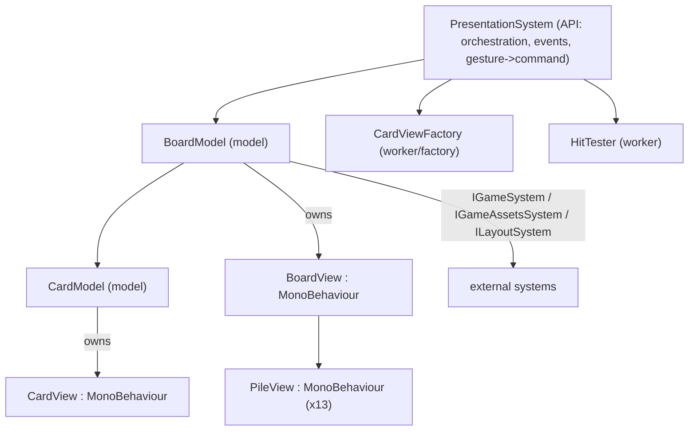
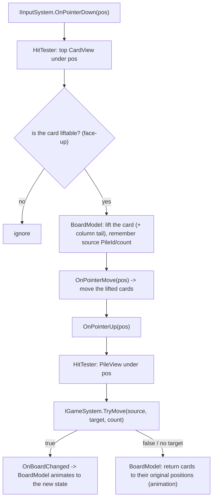

# Presentation System (PresentationSystem)

> **Type:** System
> **API class:** `PresentationSystem`
> **Interface:** `IPresentationSystem`
> **References:** [00-overview.md](00-overview.md), [01-game-system.md](01-game-system.md), [05-input-system.md](05-input-system.md), [06-assets-system.md](06-assets-system.md), [07-layout-system.md](07-layout-system.md), [unity-rules.md](../Architecture/unity-rules.md)

---

## 1. Purpose

`PresentationSystem` is responsible for **visuals only**: card sprites, text, animation (LitMotion), and moving cards nicely around the field. It renders the current `BoardState`, reacts to `IGameSystem` events, shows dragging based on `IInputSystem` events, and **translates** completed gestures into `IGameSystem` commands.

The system **contains no game rules**: it does not decide whether a move is legal, does not mutate the board, does not detect a win, does not load assets, and does not compute positions — all of that lives in external systems passed in as dependencies (`IGameSystem`, `IInputSystem`, `IGameAssetsSystem`, `ILayoutSystem`).

It is built with the Model/View pattern ([unity-rules.md](../Architecture/unity-rules.md) §2–4): a `Model` aggregates external systems and owns its `View`; a `View` is display only.

---

## 2. Responsibility boundaries

### In scope:

| Responsibility | Description |
|---|---|
| Build the board | Create `BoardView`, piles, and cards from `GameAssetsSystem` prefabs/sprites |
| Render the state | Sync `CardView`s with `BoardState`, face/back, positions from `LayoutSystem` |
| Animation | Move/flip cards via LitMotion on `OnBoardChanged` |
| Drag visuals | Lift a card (group) with the pointer based on `IInputSystem` events |
| View hit-testing | Which card/pile is under the pointer (the view geometry belongs to presentation) |
| Gesture translation | Completed drag → `IGameSystem.TryMove`; tap on the stock → `DrawStock`; buttons → `Undo/Redo/StartNewGame` |
| Win screen | A simple visual reaction to `OnGameWon` |

### Out of scope:

| Responsibility | Owner |
|---|---|
| Rules, validation, board mutation, win | `GameSystem` / `RulesSubSystem` |
| Raw input and gesture classification | `InputSystem` ([05-input-system.md](05-input-system.md)) |
| Asset loading/unloading | `GameAssetsSystem` ([06-assets-system.md](06-assets-system.md)) |
| Computing pile/card positions | `LayoutSystem` ([07-layout-system.md](07-layout-system.md)) |
| Move history | `UndoSystem` (via `IGameSystem`) |

---

## 3. Dependencies and links

| Dependency | Why |
|---|---|
| `IGameSystem` | read `State`, subscribe to `OnBoardChanged`/`OnGameWon`, invoke commands |
| `IInputSystem` | pointer events for drag/tap |
| `IGameAssetsSystem` | card sprites and view prefabs |
| `ILayoutSystem` | target positions of piles and cards |



Subscriptions: created in `InitializeAsync`, removed in `DisposeAsync`, with delegates stored ([event-subscriptions.md](../Architecture/event-subscriptions.md)).

---

## 4. Contract

```csharp
public interface IPresentationSystem
{
    UniTask InitializeAsync(CancellationToken ct = default);
    UniTask DisposeAsync();
}
```

The external API is minimal — the system is reactive: after `InitializeAsync` it renders changes from `IGameSystem` events and handles input on its own. It is called from `CoreFlow` **after** `GameAssetsSystem.LoadAsync`.

---

## 5. Interaction flow (drag-and-drop)



Move legality is decided by `GameSystem`; presentation merely **attempts** the move and plays the result nicely.

---

## 6. Requirements

### REQ-PRES-001: Initialization and subscriptions

**Description:** `InitializeAsync` builds the board skeleton and subscribes to events.

**Behavior:**
1. Create a `BoardView` (prefab from `IGameAssetsSystem.BoardViewPrefab`) in the `Core` scene root.
2. Create 13 `PileView`s (stock, waste, 4 foundations, 7 columns) and place them via `ILayoutSystem.GetPilePosition`.
3. Subscribe to `IGameSystem.OnBoardChanged`, `IGameSystem.OnGameWon`, and `IInputSystem` events (stored delegates).
4. Render the current `IGameSystem.State` (REQ-PRES-002).

---

### REQ-PRES-002: Sync views with state

**Description:** Bring the set of `CardView`s into agreement with `BoardState`.

**Behavior:**
1. For each pile, walk its cards; ensure a `CardView` exists (create missing ones via `CardViewFactory`).
2. Sprite: a face-up card — `IGameAssetsSystem.GetCardSprite(suit, rank)`; a face-down card — `GetCardBackSprite()`.
3. Position = `ILayoutSystem.GetPilePosition(pile)` + offset `GetCardOffset(kind, index, faceUp)`.
4. The draw order (z/sorting) matches the order within the pile.

---

### REQ-PRES-003: Animate changes

**Description:** On `OnBoardChanged`, transition to the new state with animation.

**Behavior:**
1. Move the changed `CardView`s to their new positions via LitMotion (duration from `RuntimeConstants.Presentation`).
2. Animate the flip of cards whose `FaceUp` changed (swap the sprite mid-tween).
3. When done, the view state is identical to `BoardState`.

---

### REQ-PRES-004: Drag cards

**Description:** Drag-and-drop based on `IInputSystem` events.

**Behavior:**
1. `OnPointerDown`: `HitTester` finds the top `CardView` under the pointer. If the card is face-up — "lift" it; for a tableau column also lift all cards above it (the visual tail). Remember `sourcePileId` and `count`.
2. `OnPointerMove`: move the lifted cards with the pointer (with a slight visual lift/shadow — optional).
3. `OnPointerUp`: `HitTester` finds the target `PileView`. Call `IGameSystem.TryMove(sourcePileId, targetPileId, count)`.
4. If `TryMove` returned `true` — the state changes and REQ-PRES-003 plays out the animation; if `false` or no target was found — animate the cards back to their original positions.
5. Presentation does **not** check the rules itself (apart from the UX filter "do not lift a face-down card").

---

### REQ-PRES-005: Stock draw on tap

**Description:** A tap on the stock triggers a draw.

**Behavior:**
1. On `IInputSystem.OnTap`, determine the `PileView` under the pointer.
2. If it is the stock — call `IGameSystem.DrawStock()`.

---

### REQ-PRES-006: Undo / Redo / New Game buttons

**Description:** A minimal control UI.

**Behavior:**
1. On `BoardView` — "Undo", "Redo", "New Game" buttons (uGUI).
2. They call `IGameSystem.Undo()`, `IGameSystem.Redo()`, `IGameSystem.StartNewGame()` respectively.
3. The Undo/Redo button availability may reflect `IGameSystem.CanUndo`/`CanRedo` (optional).

---

### REQ-PRES-007: Win screen

**Description:** A reaction to `OnGameWon`.

**Behavior:**
1. Show a simple win visual (a banner/label and/or a short card animation).
2. Offer "New Game" (through the same button/banner).

---

### REQ-PRES-008: Lifecycle and unsubscription

**Description:** The `InitializeAsync` / `DisposeAsync` contract.

**Behavior:**
1. All cross-system subscriptions are made in `InitializeAsync` and removed in `DisposeAsync` (store delegates, not lambdas) — [event-subscriptions.md](../Architecture/event-subscriptions.md).
2. A `Model` manages the lifecycle of its `View`s (create/release) — [unity-rules.md](../Architecture/unity-rules.md) §2.

---

### REQ-PRES-009: Visuals only

**Description:** Presentation contains no game logic.

**Behavior:**
1. No Klondike rules, position math, asset loading, or history storage in this system.
2. A `View` contains no business logic; all coordination is in the `Model`/API class, and data comes from external systems.

---

## 7. Internal structure

### File structure

```
Presentation/
├── PresentationSystem.cs   // IPresentationSystem + PresentationSystem (orchestration, events, gesture->command)
├── BoardModel.cs           // Model: owns BoardView + piles + cards; sync/animate; lift/return
├── CardModel.cs            // Model: owns CardView; sprite/flip/move of a single card
├── BoardView.cs            // View: board container, pile anchors, Undo/Redo/New Game UI buttons
├── PileView.cs             // View: a pile slot (a hit-test area)
├── CardView.cs             // View: card sprite (+ a factory method/collider)
├── CardViewFactory.cs      // worker/factory: create a CardView from a prefab via IGameAssetsSystem
└── HitTester.cs            // worker: screen pos -> top CardView / PileView by view geometry
```

### Components

| Component | Type | Depends on | Responsibility |
|---|---|---|---|
| `PresentationSystem` | API class | `IGameSystem`, `IInputSystem` | Lifecycle, subscriptions, translating gestures into commands |
| `BoardModel` | Model | `IGameSystem`, `IGameAssetsSystem`, `ILayoutSystem` | Owns the board views; sync and animation; lift/return of cards |
| `CardModel` | Model | `IGameAssetsSystem` | Owns a `CardView`; sprite, flip, move of a single card |
| `BoardView` | View | — | Container, pile anchors, buttons |
| `PileView` | View | — | A pile zone for hit-testing |
| `CardView` | View | — | Card rendering (sprite/text), collider/`RectTransform` |
| `CardViewFactory` | Worker (factory) | `IGameAssetsSystem` | Async creation of a `CardView` from a prefab ([unity-rules.md](../Architecture/unity-rules.md) §5) |
| `HitTester` | Worker | — | Find the top view under a screen point |

A `Model` depends **only on systems** (`I*System`), not on subsystems — [unity-rules.md](../Architecture/unity-rules.md) §2.

---

## 8. Dependencies

### Packages

| Package | Purpose |
|---|---|
| `jp.hadashikick.vcontainer` | Registration, `IAsyncStartable`/entry-point integration when needed |
| `com.cysharp.unitask` | `UniTask`, `InitializeAsync`/`DisposeAsync` |
| `com.annulusgames.lit-motion` | Card move/flip animation |
| `com.unity.ugui` + `media.lightside.unitext` | UI buttons and text |

### Dependencies on other systems

| Dependency | Mechanism |
|---|---|
| `IGameSystem`, `IInputSystem`, `IGameAssetsSystem`, `ILayoutSystem` | via constructor (registered in `CoreScope`) |

### Constants

`RuntimeConstants.Presentation`: animation durations (`MoveDuration`, `FlipDuration`), drag visual parameters (lift/scale), layer sorting.

---

## 9. Usage in CoreFlow

```csharp
public async void Start()
{
    await _gameAssets.LoadAsync();          // 06-assets-system
    await _presentation.InitializeAsync();  // subscriptions + board skeleton
    _game.StartNewGame();                   // 01-game-system -> OnBoardChanged -> presentation builds the board
}
```

---

## 10. Implementation checklist

- [ ] `IPresentationSystem` + `PresentationSystem` (`InitializeAsync`/`DisposeAsync`).
- [ ] `BoardModel`/`CardModel` (Model) + `BoardView`/`PileView`/`CardView` (View) per the Model/View pattern.
- [ ] `CardViewFactory` via `IGameAssetsSystem`; `HitTester` for hit-testing (REQ-PRES-001/004).
- [ ] Sync views with `BoardState`, face/back sprites (REQ-PRES-002).
- [ ] LitMotion move/flip animation (REQ-PRES-003).
- [ ] Drag-and-drop → `IGameSystem.TryMove` with return-on-reject (REQ-PRES-004).
- [ ] Tap on the stock → `DrawStock` (REQ-PRES-005).
- [ ] Undo/Redo/New Game buttons → `IGameSystem` (REQ-PRES-006).
- [ ] Reaction to `OnGameWon` (REQ-PRES-007).
- [ ] Subscribe in `InitializeAsync`, unsubscribe in `DisposeAsync` (REQ-PRES-008).
- [ ] Zero game logic/loading/position math in presentation (REQ-PRES-009).
- [ ] Parameters in `RuntimeConstants.Presentation`.
- [ ] EditorTask: the `Core` scene, the `CardView`/`PileView`/`BoardView` prefabs, registration in `CoreScope` (manual editor work, see [unity-rules.md](../Architecture/unity-rules.md) §1).
